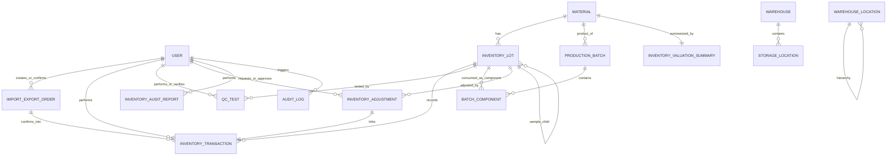

# 02_Domain Model

## 1. Mục tiêu tài liệu
Tài liệu này trình bày các thực thể nghiệp vụ trong đời sống thực của bài toán quản lý kho theo lô, cách phần mềm biểu diễn các thực thể đó, và mối liên hệ giữa chúng.

Phạm vi cập nhật dựa trên code hiện tại của hệ thống, tập trung vào các schema và nghiệp vụ đã triển khai thật.

---

## 2. Bức tranh nghiệp vụ đời sống thực

### 2.1 Các thực thể đời sống thực chính
- Vật tư hàng hóa: danh mục vật tư được doanh nghiệp quản lý (nguyên liệu, API, tá dược, vật tư kiểm nghiệm, v.v.).
- Lô hàng: mỗi lần nhận hoặc hình thành thành phẩm đều tạo một lô riêng để truy vết.
- Phiếu nhập/xuất: chứng từ nghiệp vụ ghi nhận nhu cầu nhập kho hoặc xuất kho trước khi được xác nhận chính thức.
- Kiểm soát chất lượng: hoạt động kiểm định lô để ra quyết định đạt, không đạt, hoặc giữ lại.
- Lệnh sản xuất theo mẻ: kế hoạch sản xuất thành phẩm từ nhiều lô nguyên liệu.
- Thành phần mẻ sản xuất: các lô nguyên liệu và lượng sử dụng cho từng mẻ.
- Kho và vị trí lưu trữ: kho, khu vực, kệ, ô chứa dùng để định vị hàng thật trong thực địa.
- Giao dịch tồn kho: mọi thay đổi số lượng cần được ghi nhận để truy vết.
- Điều chỉnh tồn kho: nghiệp vụ xử lý sai lệch, hư hỏng, mất mát, hết hạn.
- Báo cáo kiểm kê chính thức: tài liệu kiểm toán theo kỳ, có trạng thái xử lý và file xuất.
- Người dùng vận hành: Manager, Operator, Quality Control Technician, IT Administrator.
- Nhật ký truy vết: lịch sử tác động quan trọng phục vụ audit và điều tra sự cố.

### 2.2 Mapping đời sống thực sang phần mềm
- Hệ thống dùng các schema MongoDB để biểu diễn domain entity.
- Mỗi thực thể có business key riêng (material_id, lot_id, batch_number, order_id, adjustment_id, report_id...).
- Các quan hệ nghiệp vụ chính được giữ bằng khóa tham chiếu logic (ID dạng string) và rule ở tầng service.

---

## 3. Domain thực thể cốt lõi

### 3.1 User
Thực thể con người tham gia vận hành hệ thống.
- Mã định danh nội bộ: user_id.
- Liên kết danh tính ngoài hệ thống: keycloak_id.
- Vai trò: Manager, Operator, Quality Control Technician, IT Administrator.
- Trạng thái tài khoản: is_active, lock_type, lock_reason.
- Ghi nhận hoạt động: last_login.

Lưu ý hiện trạng: xác thực/mật khẩu không lưu trực tiếp trong user schema nghiệp vụ; hệ thống dùng Keycloak làm IdP.

### 3.2 Material
Danh mục chuẩn của vật tư/sản phẩm.
- Business key: material_id, part_number (đều unique).
- Thuộc tính nghiệp vụ: material_name, material_type, storage_conditions, specification_document.
- Trạng thái duyệt danh mục: Pending, Approved, Rejected.
- Truy vết thao tác: created_by, approved_by.

### 3.3 InventoryLot
Lô hàng thực tế trong kho.
- Business key: lot_id (unique).
- Gắn với vật tư: material_id.
- Thông tin nguồn gốc: manufacturer_name, manufacturer_lot, supplier_name.
- Thời gian vòng đời: manufacture_date, received_date, expiration_date, in_use_expiration_date.
- Tồn thực tế: quantity, unit_of_measure.
- Định vị thực địa: warehouse_id, storage_location.
- Trạng thái lô: Quarantine, Accepted, Rejected, Depleted.
- Truy vết mẫu thử: is_sample, parent_lot_id.
- Truy vết thao tác: received_by, qc_by, history.

### 3.4 InventoryTransaction
Sổ cái biến động tồn kho.
- Business key: transaction_id (unique).
- Lô bị tác động: lot_id, related_lot_id (khi cần liên kết lô khác).
- Loại giao dịch: Receipt, Usage, Split, Adjustment, Transfer, Disposal.
- Giá trị thay đổi: quantity, unit_of_measure, transaction_date.
- Chứng từ liên quan: reference_number.
- Người thao tác: performed_by.
- Liên kết điều chỉnh: adjustment_id, adjustment_reason_code.

### 3.5 ImportExportOrder
Phiếu nhập/xuất ở tầng chứng từ nghiệp vụ.
- Business key: order_id.
- Loại phiếu: Inbound, Outbound.
- Trạng thái xử lý: PendingConfirmation, Confirmed, Rejected.
- Kho áp dụng: warehouse_id.
- Thông tin người tạo/duyệt: created_by, confirmed_by, confirmed_at.
- Dữ liệu xử lý đối soát: blind_count_required, confirmed_items.
- Danh sách dòng phiếu: items (material_id, lot_id, quantity, unit_of_measure, expected_location).
- Đính kèm chứng từ: attachments (file metadata, source camera/upload, uploaded_by).

### 3.6 QCTest
Kết quả kiểm nghiệm chất lượng cho lô.
- Business key: test_id.
- Lô kiểm tra: lot_id.
- Loại test: Identity, Potency, Microbial, Growth Promotion, Physical, Chemical.
- Kết quả test: test_method, test_date, test_result, acceptance_criteria, result_status.
- Truy vết trách nhiệm: performed_by, verified_by, approved_by.
- Xử lý lỗi: reject_reason.
- Lịch sử nghiệp vụ: history.

### 3.7 ProductionBatch
Mẻ sản xuất thành phẩm.
- Business key: batch_id, batch_number (đều unique).
- Sản phẩm mục tiêu: product_id (tham chiếu material thành phẩm).
- Quy mô mẻ: batch_size, unit_of_measure.
- Thiết lập shelf-life: shelf_life_value, shelf_life_unit.
- Trạng thái mẻ: In Progress, Complete, On Hold, Cancelled.
- Truy vết thao tác: created_by, approved_by, completed_by.

### 3.8 BatchComponent
Thành phần nguyên liệu của mẻ sản xuất.
- Business key: component_id.
- Thuộc mẻ: batch_id.
- Lô nguyên liệu dùng: lot_id.
- Định lượng: planned_quantity, actual_quantity, unit_of_measure.
- Truy vết thêm dữ liệu: addition_date, added_by.

### 3.9 Warehouse, StorageLocation, WarehouseLocation
Ba thực thể mô tả không gian kho.

Warehouse:
- warehouse_id, warehouse_name, is_active.

StorageLocation:
- location_id, warehouse_id, location_name, zone, is_active.

WarehouseLocation (mô hình phân cấp cây):
- location_code, location_name, level (warehouse/zone/shelf/bin), parent_code, capacity, notes, is_active.

Ghi chú: hệ thống đang tồn tại đồng thời mô hình location theo mã kho-vị trí và mô hình cây warehouse hierarchy.

### 3.10 InventoryAdjustment
Phiếu điều chỉnh tồn kho sau đối soát.
- Business key: adjustment_id.
- Lô và vật tư bị điều chỉnh: lot_id, material_id.
- Lượng điều chỉnh: adjustment_quantity.
- Trạng thái trước/sau: quantity_before, quantity_after.
- Lý do điều chỉnh: reason_code, reason_note.
- Giá trị tồn kho: unit_cost_snapshot, valuation_before, valuation_after, valuation_delta.
- Người thao tác/phê duyệt: performed_by, approved_by.
- Liên kết giao dịch gốc: linked_transaction_id.

### 3.11 InventoryValuationSummary
Bảng tổng hợp giá trị tồn kho theo vật tư.
- Key: material_id (unique).
- Dữ liệu tổng hợp: total_quantity, unit_cost_reference, total_value.
- Truy vết cập nhật: last_adjustment_id, last_updated_by.

### 3.12 InventoryAuditReport
Báo cáo kiểm kê chính thức theo kỳ.
- Business key: report_id.
- Kỳ báo cáo: period_from, period_to.
- Phạm vi kho: scope_warehouse_ids.
- Trạng thái xử lý: PENDING, PROCESSING, READY, FAILED.
- Kết quả tổng hợp: summary_total_items, summary_total_quantity, summary_total_value.
- File đầu ra: file_storage_key, file_sha256, file_size_bytes, pdf_version.
- Chữ ký và metadata: signed_at, signature_provider, signature_serial_number, signature_valid_from, signature_valid_to.
- Trách nhiệm xử lý: requested_by, approved_by.
- Lỗi xử lý: failure_reason.

### 3.13 LabelTemplate
Mẫu nội dung nhãn cho lô/mẻ.
- Key: template_id.
- Loại nhãn: Raw Material, Sample, Intermediate, Finished Product, API, Status.
- Nội dung template: template_content.
- Kích thước: width, height.

Ghi chú hiện trạng: hệ thống hiện generate nội dung nhãn theo template, chưa có schema riêng để lưu một thực thể Label đã phát hành.

### 3.14 AuditLog và AppLog
AuditLog:
- Theo dõi hành vi nghiệp vụ và bảo mật (login, logout, user update, inventory_lot_updated...).

AppLog:
- Theo dõi log kỹ thuật hệ thống (error_code, session_id, module, stack...).

Hai nhóm log này là thực thể truy vết phục vụ vận hành và kiểm toán, không phải thực thể hàng hóa.

### 3.15 Counter (hỗ trợ hạ tầng domain)
- Lưu bộ đếm sinh số thứ tự (name, seq), dùng hỗ trợ tạo mã nghiệp vụ theo quy tắc hệ thống.

---

## 4. Mối liên hệ giữa các thực thể

### 4.1 Quan hệ lõi nghiệp vụ
- Material 1-N InventoryLot.
- InventoryLot 1-N InventoryTransaction.
- InventoryLot 1-N QCTest.
- ProductionBatch 1-N BatchComponent.
- InventoryLot 1-N BatchComponent.
- Material 1-N ProductionBatch (qua product_id).
- Warehouse 1-N StorageLocation.
- Warehouse 1-N ImportExportOrder (qua warehouse_id).
- ImportExportOrderItem tham chiếu vị trí kỳ vọng qua expected_location (mã vị trí dạng string).
- InventoryLot 1-N InventoryAdjustment.
- Material 1-1 hoặc 1-N InventoryValuationSummary (thực tế mỗi material có một summary hiện tại).
- InventoryAuditReport tham chiếu tập InventoryLot/InventoryAdjustment/InventoryTransaction theo kỳ thời gian.
- User 1-N tác động lên gần như mọi entity qua các trường performed_by, created_by, approved_by, verified_by.

### 4.2 Quan hệ tự tham chiếu
- InventoryLot (parent_lot_id) 1-N InventoryLot cho sample lot.
- WarehouseLocation (parent_code) 1-N WarehouseLocation để tạo cây warehouse -> zone -> shelf -> bin.

### 4.3 Sơ đồ quan hệ tổng quan (mức domain)

---

## 5. Quy tắc miền quan trọng (as-is)

### 5.1 Vòng đời vật tư và lô
- Material có vòng đời phê duyệt: Pending -> Approved hoặc Rejected.
- InventoryLot có vòng đời chất lượng: Quarantine -> Accepted/Rejected/Depleted.
- Rejected và Depleted là trạng thái kết thúc trong rule chuyển trạng thái hiện tại.

### 5.2 Quy tắc phiếu nhập/xuất
- Phiếu luôn khởi tạo ở PendingConfirmation.
- Chỉ Manager được confirm hoặc reject.
- Confirm sẽ cập nhật tồn lô và sinh InventoryTransaction.
- Inbound có thể cấp trước lot_id theo cơ chế reserve.
- Outbound bắt buộc kiểm tra lot và kho/vị trí phù hợp trước confirm.

### 5.3 Quy tắc sản xuất
- BatchComponent chỉ được thêm/sửa/xóa khi batch đang On Hold.
- Khi batch chuyển Complete, hệ thống:
  - kiểm tra đủ tồn nguyên liệu,
  - trừ kho nguyên liệu,
  - tạo lot thành phẩm mới (status mặc định Quarantine).

### 5.4 Quy tắc điều chỉnh tồn
- adjustment_quantity không được bằng 0.
- Không cho phép quantity sau điều chỉnh < 0.
- Bắt buộc lý do và lưu valuation delta.
- Mỗi adjustment liên kết một transaction điều chỉnh.

### 5.5 Quy tắc bảo mật và định danh
- Hệ thống dùng Keycloak cho authN/authZ trung tâm.
- User entity nội bộ đóng vai trò hồ sơ nghiệp vụ và ánh xạ vai trò cho domain.
- Truy vết nghiệp vụ dùng audit log + các trường actor trong entity.

---

## 6. Chuỗi truy vết điển hình trong đời sống thực
Ví dụ một lô nguyên liệu đi qua hệ thống:
1. Material được tạo/duyệt trong danh mục.
2. Operator tạo ImportExportOrder Inbound.
3. Manager confirm phiếu, hệ thống tạo/cập nhật InventoryLot và ghi InventoryTransaction Receipt.
4. QC tạo QCTest và ra quyết định cho lot.
5. Lot Accepted được đưa vào ProductionBatch thông qua BatchComponent.
6. Khi batch Complete, hệ thống trừ nguyên liệu và tạo lot thành phẩm mới.
7. Nếu có chênh lệch, Manager tạo InventoryAdjustment và cập nhật valuation summary.
8. Cuối kỳ, InventoryAuditReport tổng hợp dữ liệu và phát hành file phục vụ kiểm toán.

