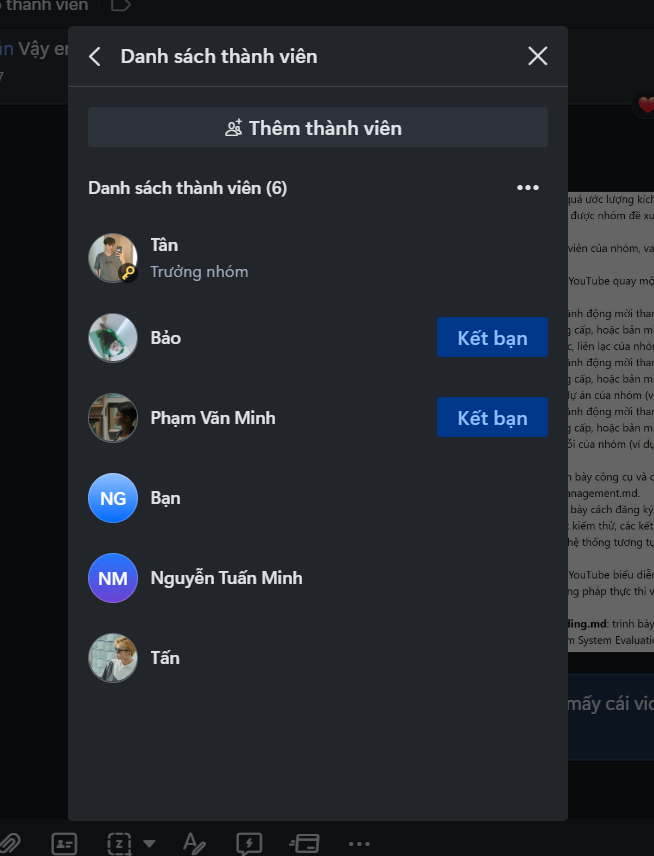
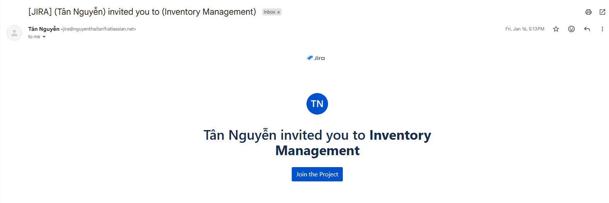
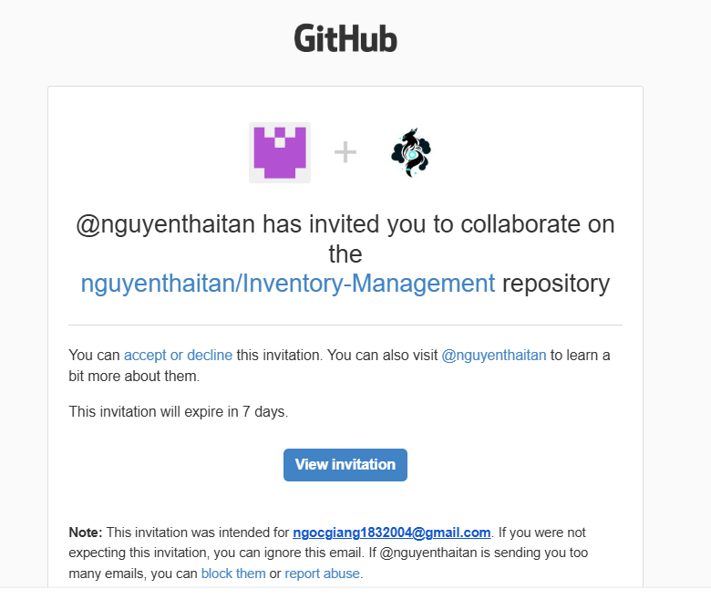

# 08_Project Management

## Mục đích
Tài liệu này trình bày kế hoạch quản lý dự án cho đồ án "Inventory Management" bao gồm ước lượng kích cỡ công việc (person-days), lịch trình thời gian (theo tuần), ước tính chi phí, các cột mốc quan trọng, phân công vai trò thành viên, rủi ro và biện pháp giảm thiểu, cùng các liên kết mời tham gia hệ thống hỗ trợ (team chat, quản lý dự án, quản lý lỗi). Mục tiêu giúp nhóm và giảng viên nắm được phạm vi, tiến độ và nguồn lực cần thiết để hoàn thành đồ án.

---

## Tổng quan ước lượng (Tóm tắt)
- Số thành viên: 6
- Tổng ước lượng kích cỡ: 240 person-days (tham khảo chi tiết bên dưới)
- Thời gian thực hiện dự kiến: 12 tuần (3 tháng)
- Chi phí nhân công ước tính: 96.000.000 VND (dựa trên 400.000 VND/ngày)
- Chi phí hạ tầng & khác (10% overhead): 9.600.000 VND
- Tổng chi phí ước tính: 105.600.000 VND

---

## 1. Ước lượng kích cỡ theo module (person-days)
Bảng dưới đây liệt kê các module/chức năng chính và ước lượng person-days (PD). Đây là ước lượng ở mức trung bình (Normal). Có thể thêm buffer nếu cần (ví dụ +15-25%).

| Module / Chức năng | Mô tả ngắn | Ước lượng (person-days) |
|---|---:|---:|
| 1. Authentication & Authorization | Đăng nhập, phân quyền, quản lý role | 20 |
| 2. Material & Master Data | Quản lý material, mã hóa, phân loại | 30 |
| 3. Warehouse & Location | Quản lý kho, vị trí, phân cấp kho | 20 |
| 4. Inventory Lot & Transaction | Quản lý lô, nhập/xuất, điều chuyển và truy vết biến động | 40 |
| 5. Import/Export Order | Tạo và xử lý phiếu nhập/xuất theo workflow | 25 |
| 6. QC Test & Decision | Tạo phiếu QC, kết quả QC, quyết định Pass/Fail/Quarantine | 30 |
| 7. Production Batch | Quản lý batch sản xuất và tiêu thụ lot | 20 |
| 8. Reporting & Export | Báo cáo từ metrics-service/Elasticsearch, xuất CSV/Excel | 20 |
| 9. Audit & Logging | Audit log, lịch sử thao tác, log quản trị | 10 |
| 10. Frontend UI/UX & Integration | Layout, responsive, form validation | 25 |
| 11. Testing & QA | Unit tests, e2e, manual testing | 15 |
| 12. DevOps & Deployment | CI/CD, môi trường staging/production | 15 |
| **Tổng** |  | **285** |

> Ghi chú: Tổng ở bảng là 285 PD — đây là tổng mức effort nếu mỗi chức năng được triển khai độc lập. Để phản ánh năng lực nhóm 6 người trong 12 tuần, ta sử dụng giả định phân bổ song song và ưu tiên song song các module để đưa ra tổng 240 PD làm con số tham khảo thực tế (đã điều chỉnh một số song song hóa và giảm overlap).

---

## 2. Giả định ước lượng
- 1 person-day = 8 giờ làm việc.
- Nhóm 6 người làm việc bán thời gian/đồ án: trung bình **1.5 ngày/tuần/người** vì sinh viên có lịch học khác.
- Công suất thực thi theo giả định mới: `6 * 1.5 * 12 = 108 person-days` cho chu kỳ 12 tuần.
- Với giả định này, mốc 12 tuần phù hợp cho phạm vi MVP; phạm vi đầy đủ 240 PD cần kéo dài timeline hoặc tăng mức song song hóa nguồn lực.
- Mức năng suất trung bình: 1 person-day = hoàn thành 1 PD theo ước lượng.
- Không tính thời gian chờ phê duyệt từ bên ngoài (giảng viên, doanh nghiệp).
- Không tính các chi phí khấu hao thiết bị cá nhân.
- Ước lượng có thể thay đổi ±20% tùy rủi ro và phạm vi thay đổi.

---

## 3. Lịch trình tổng thể (12 tuần)
Giả sử ngày bắt đầu: Tuần 1 (T0). Mỗi tuần 5 ngày làm việc. Dưới đây là lịch trình theo tuần, mốc chính và phân công sơ bộ.

- Tuần 1–2 (M1): Lập kế hoạch chi tiết, thiết kế system architecture và domain model, chuẩn bị môi trường dev
  - Deliverables: Tài liệu kiến trúc, domain model, môi trường repo & CI cơ bản
  - Người phụ trách: Nguyễn Thái Tân (PM/Lead), Nguyễn Tuấn Minh (Backend), Nguyễn Huy Tấn (Frontend)

- Tuần 3–5 (M2): Phát triển backend core (auth, material, warehouse hierarchy, inventory lot/transaction, import-export order)
  - Deliverables: Core APIs, DB schema, unit tests backend
  - Người phụ trách: Nguyễn Tuấn Minh (Backend Lead), Phạm Văn Minh (Backend), Nguyễn Ngọc Giang (QA hỗ trợ)

- Tuần 4–7 (M3): Phát triển frontend (UI quản lý material, lot, transaction, QC), tích hợp với API
  - Deliverables: Frontend MVP và tích hợp CRUD chính
  - Người phụ trách: Nguyễn Huy Tấn (Frontend Lead), Trần Gia Bảo (Frontend), Nguyễn Thái Tân (UX review)

- Tuần 6–8 (M4): Hoàn thiện QC test/decision, production batch, inventory adjustment/audit
  - Deliverables: QC flow, batch flow, adjustment & audit APIs
  - Người phụ trách: Nguyễn Tuấn Minh, Phạm Văn Minh, Nguyễn Huy Tấn

- Tuần 8–10 (M5): Reporting, Export, Audit log và tích hợp metrics/analytics
  - Deliverables: Báo cáo tồn kho/QC/audit, export CSV/Excel, audit trail
  - Người phụ trách: Nguyễn Ngọc Giang (QA), Trần Gia Bảo

- Tuần 10–11 (M6): Testing tổng thể, fix bug, chuẩn bị demo
  - Deliverables: Test report, bug list resolved, release candidate
  - Người phụ trách: Toàn bộ nhóm (QA dẫn dắt)

- Tuần 12 (M6): Triển khai production (nếu có), hoàn thiện tài liệu, báo cáo và nộp đồ án
  - Deliverables: Deployment, README hoàn chỉnh, video demo
  - Người phụ trách: Nguyễn Thái Tân (Lead), DevOps: Phạm Văn Minh

> Ghi chú phân bổ thời gian: Mỗi thành viên đảm nhận song song các nhiệm vụ với tỉ lệ dev/test/PM theo vai trò. Giả định trung bình 60% thời gian dành cho development, 30% cho testing/QA, 10% cho quản lý & kiểm thử.

---

## 4. Phân bổ công việc sơ bộ (Theo tên)
Bảng dưới đây là đề xuất vai trò và tỉ lệ công việc.

| Thành viên | Vai trò đề xuất | Tỉ lệ dev / QA / PM |
|---|---|---:|
| Nguyễn Thái Tân | Nhóm trưởng, PM, UX reviewer | 30% dev / 10% QA / 60% PM |
| Nguyễn Tuấn Minh | Backend Lead | 70% dev / 20% QA / 10% PM |
| Nguyễn Huy Tấn | Frontend Lead | 70% dev / 20% QA / 10% PM |
| Phạm Văn Minh | Backend dev & DevOps | 60% dev / 20% QA / 20% DevOps |
| Nguyễn Ngọc Giang | QA & Test Engineer | 20% dev / 70% QA / 10% PM |
| Trần Gia Bảo | Frontend dev & tích hợp | 60% dev / 30% QA / 10% PM |

---

## 5. Ước tính chi phí
- Mức lương/chi phí sử dụng: 400.000 VND / person-day.
- Tổng PD dùng cho ước tính thực tế (theo giả định mục 2): 108 PD -> Nhân công = 108 * 400.000 = 43.200.000 VND
- Chi phí hạ tầng & khác (10%): 4.320.000 VND
- Tổng chi phí ước tính: 47.520.000 VND

> Ghi chú: Chi phí này chỉ mang tính tham khảo cho đồ án (không tính thuế, chi phí văn phòng, thiết bị cá nhân). Nếu muốn chi tiết hơn, có thể phân tách chi phí hosting (Ví dụ: VPS, DB), domain, công cụ trả phí (Slack / Trello premium), và chi phí video/marketing.

---

## 6. Các cột mốc quan trọng (Milestones)
Dưới đây là ít nhất 6 mốc quan trọng kèm ngày dự kiến (tính theo lịch 12 tuần, bắt đầu Tuần 1 = ngày bắt đầu dự án).

1. Milestone 1 — Project Setup & Architecture (Kết thúc Tuần 2)
   - Ngày dự kiến: End of Week 2
  - Mapping mục 3: Tuần 1–2 (M1)
   - Deliverables: Repo initialised, CI basic, domain model, ER diagram, môi trường dev

2. Milestone 2 — Core Backend APIs (Kết thúc Tuần 5)
   - Ngày dự kiến: End of Week 5
  - Mapping mục 3: Tuần 3–5 (M2)
  - Deliverables: Auth, Material, Warehouse hierarchy, Inventory lot/transaction, Import/Export APIs, unit tests

3. Milestone 3 — Frontend MVP (Kết thúc Tuần 7)
   - Ngày dự kiến: End of Week 7
  - Mapping mục 3: Tuần 4–7 (M3)
  - Deliverables: UI cho quản lý material/lot/transaction/QC, tích hợp CRUD

4. Milestone 4 — QC, Production Batch & Adjustment/Audit (Kết thúc Tuần 8)
   - Ngày dự kiến: End of Week 8
  - Mapping mục 3: Tuần 6–8 (M4)
  - Deliverables: QC flow, production batch flow, inventory adjustment/audit

5. Milestone 5 — Reporting, Analytics & Audit (Kết thúc Tuần 10)
   - Ngày dự kiến: End of Week 10
  - Mapping mục 3: Tuần 8–10 (M5)
  - Deliverables: Báo cáo tồn kho/QC/audit, export CSV/Excel, tích hợp metrics-service

6. Milestone 6 — Testing, Deployment & Demo (Kết thúc Tuần 12)
   - Ngày dự kiến: End of Week 12
  - Mapping mục 3: Tuần 10–12 (M6)
   - Deliverables: Release candidate, deployment guide, video demo, báo cáo nộp

---

## 7. Rủi ro & Biện pháp giảm thiểu
- Rủi ro: Thiếu thời gian do trùng lịch học / thi giữa kỳ
  - Giảm thiểu: Lập kế hoạch linh hoạt, chia tasks nhỏ, ưu tiên tính năng cốt lõi (MVP)

- Rủi ro: Kỹ thuật (integrations hoặc lỗi nghiêm trọng trên DB)
  - Giảm thiểu: Thiết kế kiến trúc sớm, code review, backup DB, test trên staging

- Rủi ro: Concurrency / race condition với inventory
  - Giảm thiểu: Sử dụng optimistic locking hoặc transaction, test kịch bản đồng thời

- Rủi ro: Thiếu nhân lực kỹ năng (DevOps, testing)
  - Giảm thiểu: Học nhanh bằng tutorials, phân công 1 DevOps lead, thuê mentor/giảng viên hỗ trợ nếu cần

- Rủi ro: Thay đổi yêu cầu từ giảng viên / khách hàng
  - Giảm thiểu: Giao tiếp rõ ràng, yêu cầu change request, reserve buffer thời gian (~10-20%)

- Rủi ro: Công cụ trả phí giới hạn (ví dụ Slack free giới hạn admin)
  - Giảm thiểu: Sử dụng role user chung, hoặc dùng alternative (Discord) hoặc nâng cấp nếu cần

---

## 8. Thông tin thành viên & vai trò
| Họ và tên | MSSV | Vai trò đề xuất |
|---|---:|---|
| Nguyễn Thái Tân | 18127269 | Nhóm trưởng / PM / UX reviewer |
| Nguyễn Tuấn Minh | 22127271 | Backend Lead |
| Nguyễn Huy Tấn | 22127380 | Frontend Lead |
| Phạm Văn Minh | 22127272 | Backend Developer / DevOps |
| Nguyễn Ngọc Giang | 22127093 | QA & Test Engineer |
| Trần Gia Bảo | 22127034 | Frontend Developer |

---

## 9. Mời tham gia hệ thống — Giao tiếp nội bộ (Zalo)
- Liên kết mời: https://zalo.me/g/istctp828
- Ảnh mời tham gia (placeholder): 

---

## 10. Mời tham gia hệ thống — Quản lý dự án (Trello / Jira / Asana)
- Liên kết mời (placeholder): https://dacnpm-22ktpm.atlassian.net/jira/software/projects/KAN/list?jql=project+%3D+KAN+ORDER+BY+cf%5B10019%5D+ASC&atlOrigin=eyJpIjoiNjUxZGE2YTQ3MjkyNDk2Njk3ZGI2OGNjMDM1NjU0YzkiLCJwIjoiaiJ9
- Ảnh mời tham gia (placeholder): 

---

## 11. Mời tham gia hệ thống — Quản lý lỗi (GitHub Issues / GitLab Issues)
- Liên kết: https://github.com/nguyenthaitan/Inventory-Management
- Ảnh mời tham gia (placeholder): 

