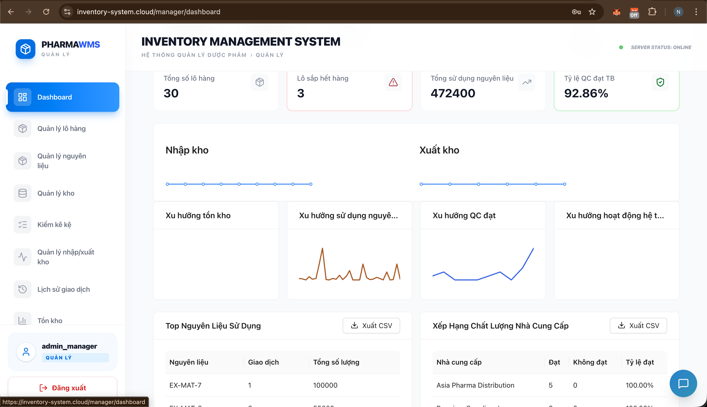
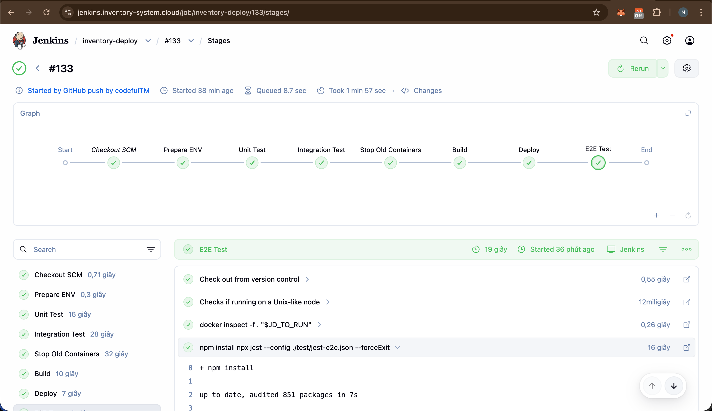
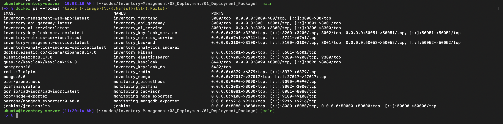
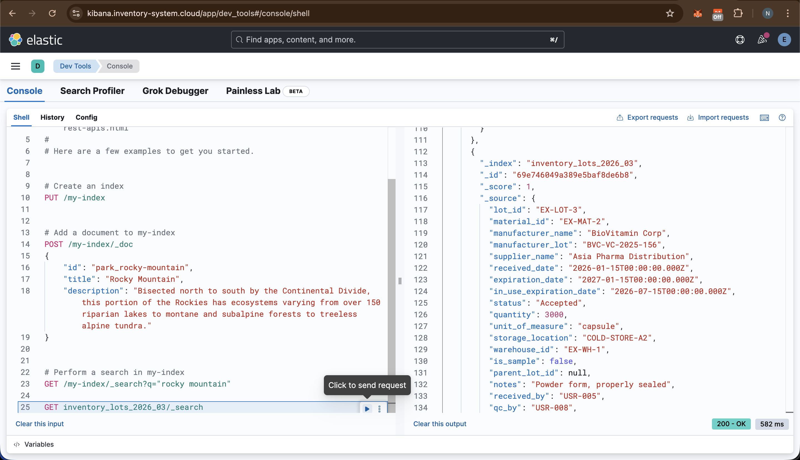
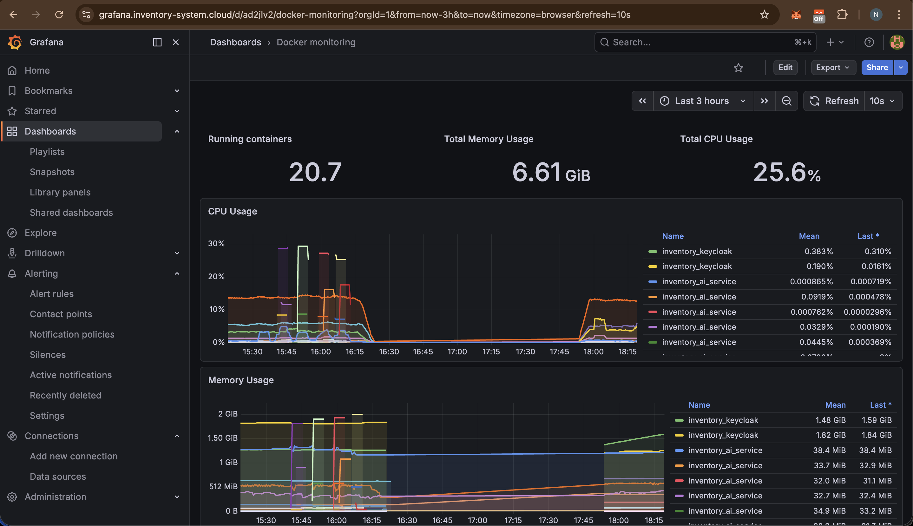

# Hướng Dẫn Deploy - Inventory Management System

> **Mục tiêu tài liệu:** Hướng dẫn đầy đủ cho **IT Administrator** cách đăng ký dịch vụ, cài đặt môi trường, cấu hình CI/CD, thực thi IaC và vận hành hệ thống Inventory Management trên Internet.

---

## Mục Lục

1. [Tổng quan hệ thống](#1-tổng-quan-hệ-thống)
2. [Đăng ký dịch vụ và chuẩn bị hạ tầng](#2-đăng-ký-dịch-vụ-và-chuẩn-bị-hạ-tầng)
3. [Cấu trúc thư mục trên VPS](#3-cấu-trúc-thư-mục-trên-vps)
4. [Cài đặt hệ thống cơ bản](#4-cài-đặt-hệ-thống-cơ-bản)
5. [Cài đặt Docker](#5-cài-đặt-docker)
6. [Clone code và cấu hình](#6-clone-code-và-cấu-hình)
7. [Cài đặt Nginx và SSL](#7-cài-đặt-nginx-và-ssl)
8. [Khởi động Infrastructure — IaC (Base Services)](#8-khởi-động-infrastructure--iac-base-services)
9. [Cấu hình Keycloak](#9-cấu-hình-keycloak)
10. [Cài đặt và cấu hình Jenkins (CI/CD)](#10-cài-đặt-và-cấu-hình-jenkins-cicd)
11. [Deploy ứng dụng](#11-deploy-ứng-dụng)
12. [Kiểm tra hệ thống](#12-kiểm-tra-hệ-thống)
13. [Kết quả sau triển khai](#13-kết-quả-sau-triển-khai)
14. [Video Demo Triển Khai](#14-video-demo-triển-khai)

---

## 1. Tổng quan hệ thống

### 1.1 Kiến trúc tổng thể

Hệ thống Inventory Management được triển khai theo mô hình **microservices** chạy trên Docker Compose, phơi ra Internet thông qua Nginx reverse proxy và HTTPS (Let's Encrypt).

```
Internet
   │
   ▼
[Nginx + SSL]  (inventory-system.cloud và các subdomain)
   │
   ├──► [Frontend — React/Vite]          :3000
   ├──► [API Gateway — NestJS]           :3001
   │        │
   │        ├──► [Backend Service]       :3100
   │        ├──► [Keycloak Service]      :3200
   │        ├──► [AI Service]            :3300
   │        ├──► [Analytics Indexer]
   │        └──► [Metrics Service]
   │
   ├──► [Keycloak — Auth Server]         :8090
   ├──► [Jenkins — CI/CD]                :8080
   ├──► [Kibana — Log Viewer]            :5601
   └──► [Grafana — Metrics Dashboard]    :3000 (internal)

Infrastructure (không phơi trực tiếp ra Internet):
   ├── MongoDB    :27017
   ├── Redis      :6379
   └── Elasticsearch  :9200
```

### 1.2 Danh sách dịch vụ và vai trò

| Dịch vụ | Image / Công nghệ | Vai trò |
|---|---|---|
| **Frontend** | React + Vite (built static) | Giao diện người dùng |
| **API Gateway** | NestJS | Điểm vào duy nhất, xác thực JWT, định tuyến |
| **Backend** | NestJS | Nghiệp vụ kho hàng (vật tư, lô, giao dịch, ...) |
| **Keycloak Service** | NestJS | Proxy quản lý users/roles qua Keycloak Admin API |
| **AI Service** | NestJS | Tính năng gợi ý AI (HuggingFace, Google Gemini) |
| **Analytics Indexer** | NestJS | Đẩy dữ liệu vào Elasticsearch |
| **Metrics Service** | NestJS | Thu thập metrics cho Grafana |
| **Keycloak** | `quay.io/keycloak/keycloak:23` | Authentication & Authorization (OAuth2/OIDC) |
| **MongoDB** | `mongo:7` | Database chính |
| **Redis** | `redis:7-alpine` | Cache + auto-ID generation |
| **Elasticsearch** | `elasticsearch:8.x` | Full-text search, log storage |
| **Kibana** | `kibana:8.x` | Trực quan hóa logs |
| **Grafana** | `grafana/grafana` | Trực quan hóa metrics |
| **Jenkins** | `jenkins/jenkins:lts` | CI/CD pipeline |
| **Nginx** | System package | Reverse proxy + SSL termination |

### 1.3 Phân quyền hệ thống

| Vai trò | Quyền hạn |
|---|---|
| **Manager** | Quản lý vật tư, lô sản xuất, phiếu nhập/xuất, báo cáo, dashboard |
| **Operator** | Tạo phiếu nhập/xuất, kiểm kê, xem dashboard |
| **QC Inspector** | Tạo và phê duyệt phiếu kiểm tra chất lượng |
| **IT Administrator** | Quản lý users/roles trong Keycloak, vận hành hạ tầng |

---

## 2. Đăng ký dịch vụ và chuẩn bị hạ tầng

### 2.1 Đăng ký VPS (Cloud Server)

**Nhà cung cấp được khuyến nghị:** DigitalOcean, Hetzner Cloud, Vultr, hoặc Linode.

**Cấu hình tối thiểu:**
| Thông số | Tối thiểu | Khuyến nghị |
|---|---|---|
| CPU | 2 vCPU | 4 vCPU |
| RAM | 4 GB | 8 GB |
| Ổ cứng | 40 GB SSD | 80 GB SSD |
| Hệ điều hành | Ubuntu 22.04 LTS | Ubuntu 22.04 LTS |
| Băng thông | 2 TB/tháng | 4 TB/tháng |

**Các bước đăng ký VPS (ví dụ với DigitalOcean):**
1. Tạo tài khoản tại [digitalocean.com](https://digitalocean.com)
2. Vào **Droplets** → **Create Droplet**
3. Chọn **Ubuntu 22.04 LTS**, size phù hợp
4. Thêm SSH key của máy local vào VPS để đăng nhập không cần password
5. Ghi lại địa chỉ **IP public** của VPS sau khi tạo xong

### 2.2 Đăng ký tên miền (Domain)

1. Đăng ký domain tại nhà cung cấp (Namecheap, GoDaddy, Name.com, ...)
2. Tên domain ví dụ: `inventory-system.cloud`
3. Trỏ **tất cả các subdomain** về IP VPS bằng cách thêm A Records:

| DNS Record | Type | Value |
|---|---|---|
| `@` (inventory-system.cloud) | A | `<VPS_IP>` |
| `www` | A | `<VPS_IP>` |
| `api` | A | `<VPS_IP>` |
| `keycloak` | A | `<VPS_IP>` |
| `jenkins` | A | `<VPS_IP>` |
| `kibana` | A | `<VPS_IP>` |
| `grafana` | A | `<VPS_IP>` |

> **Lưu ý:** DNS propagation có thể mất từ vài phút đến 48 giờ. Kiểm tra bằng lệnh:
> ```bash
> nslookup inventory-system.cloud
> nslookup api.inventory-system.cloud
> ```

### 2.3 Cấu hình Firewall (UFW)

```bash
sudo ufw allow OpenSSH
sudo ufw allow 'Nginx Full'    # HTTP (80) và HTTPS (443)
sudo ufw allow 8080/tcp        # Jenkins (nếu chưa có Nginx proxy)
sudo ufw enable
sudo ufw status
```

### 2.4 Cài đặt SSH Key cho deployment

```bash
# Trên máy local — tạo key dành riêng cho deployment
ssh-keygen -t ed25519 -C "deploy@inventory-server" -f ~/.ssh/inventory_deploy

# Copy public key lên VPS
ssh-copy-id -i ~/.ssh/inventory_deploy.pub ubuntu@<VPS_IP>

# Kiểm tra đăng nhập không cần password
ssh -i ~/.ssh/inventory_deploy ubuntu@<VPS_IP>
```

---

## 3. Cấu trúc thư mục trên VPS

> **Điều kiện ban đầu:** Đã có VPS Ubuntu 22.04+ và domain đã trỏ về IP VPS (xem Mục 2).

```
/home/ubuntu/
├── codes/
│   └── Inventory-Management/        # Git repo
│       ├── 02_Source/01_Source Code/ # Application source
│       └── 03_Deployment/
│           └── 01_Deployment_Package/
│               ├── docker-compose.yml
│               ├── .env
│               └── base/
├── data/                            # Infrastructure data & compose files
│   ├── docker-compose-mongo.yml
│   ├── docker-compose-keycloak.yml
│   ├── docker-compose-redis.yml
│   ├── docker-compose-elasticsearch.yml
│   ├── data-mongo/
│   ├── data-keycloak-postgres/
│   ├── data-redis/
│   └── data-elasticsearch/
└── jenkins_home/                    # Jenkins persistent data
```

---

## 4. Cài đặt hệ thống cơ bản

### 2.1 SSH vào VPS và đặt hostname

```bash
ssh ubuntu@<VPS_IP>
sudo hostnamectl set-hostname inventory-server
sudo nano /etc/hosts
# Thêm dòng: 127.0.0.1 inventory-server
```

### 2.2 Cài đặt các công cụ cơ bản

```bash
sudo apt update && sudo apt upgrade -y
sudo apt install -y curl git nano vim fail2ban locales
```

### 2.3 Cấu hình locale

```bash
sudo apt install -y locales
sudo locale-gen en_US.UTF-8
sudo update-locale LANG=en_US.UTF-8 LC_ALL=en_US.UTF-8
echo 'export LANG=en_US.UTF-8' | sudo tee -a /etc/environment
echo 'export LC_ALL=en_US.UTF-8' | sudo tee -a /etc/environment
```

### 2.4 Cài đặt Node.js và Yarn

```bash
curl -fsSL https://deb.nodesource.com/setup_22.x | sudo -E bash -
sudo apt install -y nodejs
sudo npm install -g yarn
```

Kiểm tra:
```bash
node -v
yarn --version
```

### 2.5 Bảo mật cơ bản với fail2ban

```bash
sudo cp /etc/fail2ban/jail.conf /etc/fail2ban/jail.local
sudo systemctl restart fail2ban
```

---

## 5. Cài đặt Docker

```bash
# Cài Docker
curl -fsSL https://get.docker.com | sudo sh

# Cài Docker Compose plugin
sudo apt install -y docker-compose-plugin

# Thêm user ubuntu vào group docker (không cần sudo mỗi lần)
sudo usermod -aG docker ubuntu

# Enable Docker auto-start
sudo systemctl enable docker
sudo systemctl start docker

# Đăng xuất và SSH lại để group có hiệu lực
exit
```

> **Lưu ý:** Phải đăng xuất và SSH lại để lệnh `docker` chạy được không cần `sudo`.

Kiểm tra sau khi SSH lại:
```bash
docker --version
docker compose version
docker run hello-world
```

---

## 6. Clone code và cấu hình

### 4.1 Tạo thư mục và clone repo

```bash
mkdir -p ~/codes ~/data
cd ~/codes
git clone git@github.com:nguyenthaitan/Inventory-Management.git
```

> **Lưu ý:** Cần tạo SSH key và thêm vào GitHub trước:
> ```bash
> ssh-keygen -t ed25519 -C "deploy@inventory-server"
> cat ~/.ssh/id_ed25519.pub   # Copy và thêm vào GitHub → Settings → SSH Keys
> ```

### 4.2 Tạo file `.env` cho production

```bash
cp ~/codes/Inventory-Management/03_Deployment/01_Deployment_Package/.env.example \
   ~/codes/Inventory-Management/03_Deployment/01_Deployment_Package/.env

nano ~/codes/Inventory-Management/03_Deployment/01_Deployment_Package/.env
```

Chỉnh sửa các giá trị quan trọng:
```env
# MongoDB
MONGO_USER=admin
MONGO_PASSWORD=<mật_khẩu_mạnh>

# Keycloak
KEYCLOAK_ADMIN_PASSWORD=<mật_khẩu_admin_keycloak>
KEYCLOAK_CLIENT_SECRET=<secret_từ_keycloak_console>
KC_HOSTNAME_URL=https://keycloak.inventory-system.cloud
KC_HOSTNAME_ADMIN_URL=https://keycloak.inventory-system.cloud

# JWT
JWT_SECRET=<chuỗi_ngẫu_nhiên_dài_ít_nhất_32_ký_tự>
JWT_ISSUER=https://keycloak.inventory-system.cloud/realms/inventory

# Redis
REDIS_PASSWORD=<mật_khẩu_redis>

# CORS
FRONTEND_ORIGIN=https://inventory-system.cloud
VITE_API_URL=https://api.inventory-system.cloud

# AI (optional)
HUGGINGFACE_API_KEY=
GOOGLE_API_KEY=
```

### 4.3 Copy file compose base về thư mục data

```bash
cp ~/codes/Inventory-Management/03_Deployment/01_Deployment_Package/base/docker-compose-mongo.yml ~/data/
cp ~/codes/Inventory-Management/03_Deployment/01_Deployment_Package/base/docker-compose-keycloak.yml ~/data/
cp ~/codes/Inventory-Management/03_Deployment/01_Deployment_Package/base/docker-compose-redis.yml ~/data/
cp ~/codes/Inventory-Management/03_Deployment/01_Deployment_Package/base/docker-compose-elasticsearch.yml ~/data/
```

---

## 7. Cài đặt Nginx và SSL

### 5.1 Cài đặt Nginx và Certbot

```bash
sudo apt install -y nginx certbot python3-certbot-nginx
sudo mkdir -p /var/www/certbot
sudo chown -R www-data:www-data /var/www
```

### 5.2 Deploy Nginx config bằng script

```bash
cd ~/codes/Inventory-Management/03_Deployment/01_Deployment_Package/nginx
chmod +x install.sh
sudo ./install.sh
```

> Script sẽ copy toàn bộ config trong `sites-available/` vào `/etc/nginx/sites-available/`, tạo symlink vào `sites-enabled/`, kiểm tra và reload Nginx.

### 5.3 Cấp SSL

```bash
# Cấp SSL cho tất cả domain (chỉ nếu chưa có)
if ! sudo certbot certificates | grep -q "inventory-system.cloud"; then
  sudo certbot --nginx \
    -d inventory-system.cloud \
    -d www.inventory-system.cloud \
    -d api.inventory-system.cloud \
    -d keycloak.inventory-system.cloud \
    -d jenkins.inventory-system.cloud \
    -d kibana.inventory-system.cloud \
    -d grafana.inventory-system.cloud \
    --agree-tos \
    --no-eff-email \
    -m your-email@example.com \
    --redirect
else
  echo "SSL certificates already installed"
fi

# Kiểm tra lại config Nginx
sudo nginx -t
sudo systemctl reload nginx

# Xem danh sách certificates đã cài
sudo certbot certificates
```

---

## 8. Khởi động Infrastructure — IaC (Base Services)

### Khái niệm IaC trong dự án này

Dự án sử dụng **Docker Compose** như công cụ **Infrastructure as Code (IaC)**: toàn bộ hạ tầng (databases, cache, search engine, auth server) được định nghĩa dưới dạng file YAML có thể version-controlled và tái tạo lại hoàn toàn chỉ bằng một lệnh.

```
03_Deployment/01_Deployment_Package/base/
├── docker-compose-mongo.yml         # MongoDB
├── docker-compose-redis.yml         # Redis
├── docker-compose-elasticsearch.yml # Elasticsearch + Kibana
└── docker-compose-keycloak.yml      # Keycloak + PostgreSQL
```

**Nguyên tắc vận hành IaC:**
- Mọi thay đổi hạ tầng đều thực hiện qua file YAML (không SSH vào container để sửa)
- File `.env` chứa secrets, **không commit lên Git**
- Chạy lại `docker compose up -d` sau khi sửa YAML để áp dụng thay đổi

### 8.1 Tạo Docker network dùng chung

```bash
docker network create inventory_network
```

### 8.2 Khởi động MongoDB

```bash
cd ~/data
docker compose -f docker-compose-mongo.yml up -d
docker logs inventory_mongo --tail 20
```

### 8.3 Khởi động Redis

```bash
cd ~/data
docker compose -f docker-compose-redis.yml up -d
docker logs inventory_redis --tail 10
```

### 8.4 Khởi động Elasticsearch

Elasticsearch yêu cầu thư mục data phải thuộc UID 1000:
# Tạo data directory với quyền đúng
sudo mkdir -p data-elasticsearch
sudo chown -R 1000:1000 data-elasticsearch
sudo chmod -R 755 data-elasticsearch

```bash
cd ~/data
mkdir -p data-elasticsearch
sudo chown -R 1000:1000 data-elasticsearch
sudo chmod -R 755 data-elasticsearch
docker compose -f docker-compose-elasticsearch.yml up -d
docker logs inventory_elasticsearch --tail 20
```

Kiểm tra ES đã sẵn sàng:
```bash
curl http://localhost:9200
# Kết quả mong đợi: {"name":"...","cluster_name":"docker-cluster",...}
```

Tạo user kibana_system cho kibana connect:
```bash
docker exec -it inventory_elasticsearch bin/elasticsearch-reset-password -u kibana_system
```
Response (copy value dán vào ELASTICSEARCH_PASSWORD trong docker-compose-kibana.yml):
```
New value: abc...
```

### 8.5 Khởi động Keycloak

```bash
cd ~/data
docker compose -f docker-compose-keycloak.yml up -d
docker logs inventory_keycloak -f
# Chờ đến khi thấy: "Running the server in development mode..."
```

---

## 9. Cấu hình Keycloak

### 9.1 Truy cập Keycloak Admin Console

Mở trình duyệt: `https://keycloak.inventory-system.cloud`

Đăng nhập:
- Username: `admin`
- Password: giá trị `KEYCLOAK_ADMIN_PASSWORD` trong `.env`

### 9.2 Kiểm tra Realm

Realm `inventory` sẽ được tự động import từ file `realm-export.json`. Kiểm tra:
1. Vào **Realm Settings** → đảm bảo realm `inventory` tồn tại
2. Vào **Clients** → kiểm tra client `inventory-backend` tồn tại

### 9.3 Lấy Client Secret

1. Vào **Clients** → `inventory-backend` → tab **Credentials**
2. Copy **Client Secret**
3. Cập nhật vào `.env`:
```bash
nano ~/codes/Inventory-Management/03_Deployment/01_Deployment_Package/.env
# KEYCLOAK_CLIENT_SECRET=<secret_vừa_copy>
```

---

## 10. Cài đặt và cấu hình Jenkins (CI/CD)

### Kiến trúc CI/CD Pipeline

Hệ thống sử dụng **Jenkins** như nền tảng CI/CD. Mọi lần push code lên nhánh `main` sẽ trigger pipeline tự động:

```
Developer push → GitHub → Webhook → Jenkins Pipeline
                                          │
                          ┌───────────────┼───────────────┐
                          ▼               ▼               ▼
                    [1. Checkout]   [2. Test]        [3. Build]
                    git pull        Unit tests        docker build
                    from GitHub     Integration       frontend bundle
                                    tests
                                          │
                                          ▼
                                    [4. Deploy]
                                    docker compose up
                                    zero-downtime swap
```

**Các giai đoạn trong `Jenkinsfile`:**

| Stage | Mô tả |
|---|---|
| **Checkout** | Clone repo từ GitHub qua SSH |
| **Copy env** | Copy file `.env` từ thư mục `/home/ubuntu/data/` (không commit lên Git) |
| **Install deps** | `yarn install` cho cả backend và frontend |
| **Unit Tests** | `yarn test` — chạy 1113 unit tests |
| **Integration Tests** | `yarn test:integration` — 24 integration tests |
| **Build Backend** | `nest build` |
| **Build Frontend** | `vite build` → tạo static files |
| **Docker Build** | `docker compose build` — build tất cả Docker images |
| **Deploy** | `docker compose up -d` — khởi động/cập nhật containers |
| **Health Check** | Kiểm tra các endpoints sau deploy |

### 10.1 Tạo thư mục và khởi động Jenkins

```bash
mkdir -p ~/jenkins_home

docker run -d \
  --name jenkins \
  -p 8080:8080 \
  -p 50000:50000 \
  -v ~/jenkins_home:/var/jenkins_home \
  -v /var/run/docker.sock:/var/run/docker.sock \
  -v /home/ubuntu/codes:/home/ubuntu/codes \
  --group-add $(getent group docker | cut -d: -f3) \
  jenkins/jenkins:lts
```

> **Giải thích các tham số:**
> - `-v /var/run/docker.sock` → Jenkins có thể chạy lệnh `docker` trực tiếp
> - `-v /home/ubuntu/codes` → Jenkins truy cập được source code
> - `--group-add $(getent group docker ...)` → Jenkins user có quyền docker

### 10.2 Lấy mật khẩu ban đầu

```bash
docker exec jenkins cat /var/jenkins_home/secrets/initialAdminPassword
```

### 10.3 Cài đặt Jenkins qua Web UI

Truy cập: `https://jenkins.inventory-system.cloud`

1. **Nhập mật khẩu** vừa lấy ở bước trên
2. Chọn **"Install suggested plugins"** và chờ cài xong
3. **Tạo admin user** (ghi nhớ username/password)
4. **Configure Jenkins URL**: Đặt thành `https://jenkins.inventory-system.cloud`

### 10.4 Cài thêm plugin cần thiết

Vào **Manage Jenkins** → **Plugins** → **Available plugins**, tìm và cài:
- **Docker Pipeline** — chạy Docker trong pipeline
- **Git** — (thường đã có sẵn)
- **SSH Agent** — nếu cần SSH key cho Git

### 10.5 Tạo Pipeline Job

1. Vào **Dashboard** → **New Item**
2. Nhập tên: `inventory-deploy`
3. Chọn **Pipeline** → **OK**
4. Trong phần **Pipeline**:
   - **Definition**: `Pipeline script from SCM`
   - **SCM**: `Git`
   - **Repository URL**: `git@github.com:nguyenthaitan/Inventory-Management.git`
   - **Credentials**: Thêm SSH key deploy (xem bước 8.6)
   - **Branch**: `*/main`
   - **Script Path**: `Jenkinsfile`
5. **Save**

### 10.6 Thêm SSH Credentials cho GitHub

1. Vào **Manage Jenkins** → **Credentials** → **System** → **Global credentials** → **Add Credentials**
2. **Kind**: SSH Username with private key
3. **ID**: `github-ssh-key`
4. **Username**: `git`
5. **Private Key**: Copy nội dung `~/.ssh/id_ed25519` từ VPS:
   ```bash
   cat ~/.ssh/id_ed25519
   ```
6. **Save**

### 10.7 Cấu hình `.env` path cho Jenkins pipeline

Jenkins pipeline sử dụng lệnh:
```bash
cp /home/ubuntu/data/.env 03_Deployment/01_Deployment_Package/.env
```

Tạo symlink hoặc copy file `.env` vào thư mục data:
```bash
cp ~/codes/Inventory-Management/03_Deployment/01_Deployment_Package/.env ~/data/.env
```

> **Lưu ý:** File `.env` không được commit lên Git. Pipeline sẽ copy từ `/home/ubuntu/data/.env` vào workspace mỗi lần chạy.

---

## 11. Deploy ứng dụng

### 11.1 Deploy lần đầu (thủ công)

```bash
cd ~/codes/Inventory-Management
git pull

# Copy .env vào đúng vị trí
cp ~/data/.env 03_Deployment/01_Deployment_Package/.env

# Build và khởi động tất cả services
cd 03_Deployment/01_Deployment_Package
docker compose --env-file .env build
docker compose --env-file .env up -d
```

### 11.2 Kiểm tra containers

```bash
docker ps
# Kết quả mong đợi - thấy các container:
# inventory_frontend         (port 3000)
# inventory_api_gateway      (port 3001)
# inventory_backend          (port 3100)
# inventory_keycloak_service (port 3200)
# inventory_ai_service       (port 3300)
# inventory_analytics_indexer
# inventory_metrics_service
# inventory_mongo            (port 27017)
# inventory_keycloak         (port 8090)
# inventory_keycloak_db
# inventory_elasticsearch    (port 9200)
# inventory_redis            (port 6379)
```

### 11.3 Deploy tự động qua Jenkins

Khi code được push lên branch `main`, trigger Jenkins job:
1. Vào `https://jenkins.inventory-system.cloud`
2. Chọn job `inventory-deploy` → **Build Now**

Hoặc cấu hình **Webhook** từ GitHub:
1. Trên GitHub repo → **Settings** → **Webhooks** → **Add webhook**
2. **Payload URL**: `https://jenkins.inventory-system.cloud/github-webhook/`
3. **Content type**: `application/json`
4. **Events**: chọn **Just the push event**

---

## 12. Kiểm tra hệ thống

### 12.1 Kiểm tra các URL

| URL | Mong đợi |
|-----|----------|
| `https://inventory-system.cloud` | Frontend load được |
| `https://api.inventory-system.cloud/auth/login` | 404 hoặc 405 (endpoint tồn tại) |
| `https://keycloak.inventory-system.cloud` | Keycloak login page |
| `https://jenkins.inventory-system.cloud` | Jenkins dashboard |

### 12.2 Test API Gateway

```bash
# Test login
TOKEN=$(curl -s -X POST https://api.inventory-system.cloud/auth/login \
  -H "Content-Type: application/json" \
  -d '{"username":"admin_manager","password":"password"}' | jq -r '.data.access_token')

echo "Token: $TOKEN"

# Test protected endpoint
curl -X GET https://api.inventory-system.cloud/auth/me \
  -H "Authorization: Bearer $TOKEN"
```

### 12.3 Xem logs khi có lỗi

```bash
# Xem log service cụ thể
docker logs inventory_api_gateway -f
docker logs inventory_backend -f
docker logs inventory_keycloak -f

# Xem log tất cả services
cd ~/codes/Inventory-Management/03_Deployment/01_Deployment_Package
docker compose logs -f

# Xem trạng thái resource
docker stats --no-stream
free -h
df -h
```

### 12.4 Restart khi cần

```bash
cd ~/codes/Inventory-Management/03_Deployment/01_Deployment_Package

# Restart tất cả
docker compose --env-file .env restart

# Restart service cụ thể
docker compose --env-file .env restart api-gateway
docker compose --env-file .env restart inventory-management-service
```

---

## Phụ lục: Lệnh thường dùng

```bash
# Cập nhật code và redeploy
cd ~/codes/Inventory-Management
git pull
cp ~/data/.env 03_Deployment/01_Deployment_Package/.env
cd 03_Deployment/01_Deployment_Package
docker compose --env-file .env down
docker compose --env-file .env build
docker compose --env-file .env up -d

# Dọn dẹp Docker (khi đầy ổ đĩa)
docker system prune -af
docker builder prune -af

# Gia hạn SSL (tự động, hoặc thủ công)
sudo certbot renew --dry-run
sudo certbot renew

# Kiểm tra Nginx
sudo nginx -t
sudo systemctl reload nginx
```

---

## 13. Kết quả sau triển khai

Sau khi hoàn tất tất cả các bước trên, hệ thống sẽ hoạt động đầy đủ trên Internet với các kết quả sau:

### 13.1 Tổng quan hệ thống đã triển khai



### 13.2 Web UI — Giao diện đăng nhập

- **URL:** `https://inventory-system.cloud`
- Trang đăng nhập hiển thị, hỗ trợ đăng nhập qua Keycloak (OAuth2/OIDC)
- Sau đăng nhập, dashboard hiển thị theo vai trò: Manager / Operator / QC Inspector


**Các trang chính:**

```
https://inventory-system.cloud                    → Trang đăng nhập
https://inventory-system.cloud/dashboard          → Dashboard tổng quan
https://inventory-system.cloud/materials          → Quản lý vật tư
https://inventory-system.cloud/production-batches → Lô sản xuất
https://inventory-system.cloud/transactions       → Phiếu nhập/xuất
https://inventory-system.cloud/inventory-check    → Kiểm kê
https://inventory-system.cloud/qc-tests           → Kiểm tra chất lượng
```

### 13.3 CI/CD Pipeline — Jenkins

- **URL:** `https://jenkins.inventory-system.cloud`
- Pipeline `inventory-deploy` chạy tự động khi push code lên nhánh `main`
- Các stage: Checkout → Test (1113 unit tests) → Build → Docker Build → Deploy → Health Check



### 13.4 Docker Containers

Toàn bộ services chạy trong Docker, quản lý qua Docker Compose:



| Container | Port | Trạng thái |
|---|---|---|
| `inventory_frontend` | 3000 | Running |
| `inventory_api_gateway` | 3001 | Running |
| `inventory_backend` | 3100 | Running |
| `inventory_keycloak_service` | 3200 | Running |
| `inventory_ai_service` | 3300 | Running |
| `inventory_mongo` | 27017 | Running |
| `inventory_keycloak` | 8090 | Running |
| `inventory_elasticsearch` | 9200 | Running |
| `inventory_redis` | 6379 | Running |

### 13.5 Kibana — Log Monitoring

- **URL:** `https://kibana.inventory-system.cloud`
- Trực quan hóa logs từ tất cả services, hỗ trợ tìm kiếm full-text



### 13.6 Grafana — Metrics Dashboard

- **URL:** `https://grafana.inventory-system.cloud`
- Theo dõi metrics hệ thống: CPU, RAM, request rate, response time



### 13.7 Tổng kết URLs sau triển khai

| Dịch vụ | URL | Kết quả |
|---|---|---|
| Web UI | `https://inventory-system.cloud` | Trang đăng nhập |
| API Gateway | `https://api.inventory-system.cloud` | RESTful API (JWT) |
| Keycloak | `https://keycloak.inventory-system.cloud` | Auth server |
| Jenkins | `https://jenkins.inventory-system.cloud` | CI/CD dashboard |
| Kibana | `https://kibana.inventory-system.cloud` | Log monitoring |
| Grafana | `https://grafana.inventory-system.cloud` | Metrics dashboard |

---

## 14. Video Demo Triển Khai

> Video ghi lại quá trình nhóm triển khai hệ thống thực tế lên môi trường Internet.

### 14.1 Link Video YouTube

[](https://youtu.be/htWpwCmERTY?si=dBmVg1VUtBh3J6bx)

**URL:** [https://youtu.be/htWpwCmERTY?si=dBmVg1VUtBh3J6bx](https://youtu.be/htWpwCmERTY?si=dBmVg1VUtBh3J6bx)

### 14.2 Nội dung video

| Thời điểm | Nội dung |
|---|---|
| 0:00 – 1:00 | Giới thiệu hệ thống và kiến trúc tổng quan |
| 1:00 – 3:00 | Đăng ký VPS, domain, cấu hình DNS |
| 3:00 – 6:00 | Cài đặt môi trường: Docker, Nginx, SSL |
| 6:00 – 10:00 | Khởi động hạ tầng IaC: MongoDB, Redis, Elasticsearch, Keycloak |
| 10:00 – 13:00 | Cài đặt và cấu hình Jenkins CI/CD pipeline |
| 13:00 – 16:00 | Deploy ứng dụng lần đầu, kiểm tra containers |
| 16:00 – 20:00 | Demo kết quả: Web UI, APIs, Keycloak, Jenkins |
| 20:00 – 23:00 | Demo tính năng: Đăng nhập, quản lý vật tư, tạo phiếu nhập/xuất |
| 23:00 – 25:00 | Demo CI/CD: Push code → Jenkins tự động build và deploy |

---

*Tài liệu được cập nhật lần cuối: tháng 4/2026*
