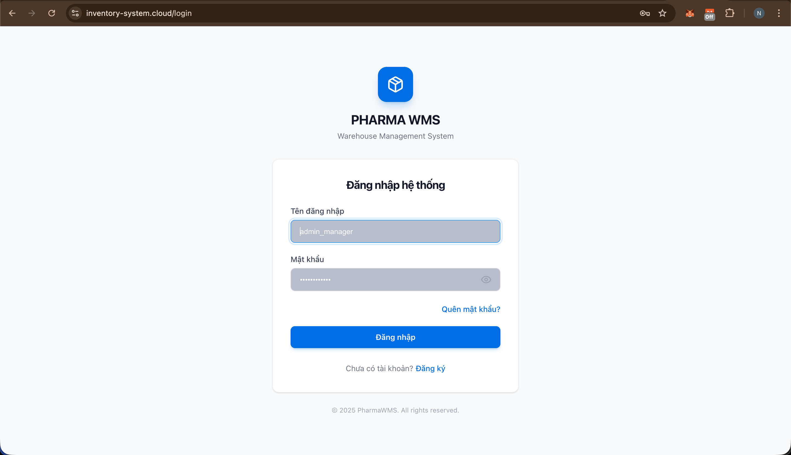

# Hướng Dẫn Sử Dụng - Inventory Management System

> **Đối tượng:** Người dùng cuối — Manager, Operator, QC Inspector, IT Administrator
>
> **URL hệ thống:** `https://inventory-system.cloud`

---

## Mục Lục

1. [Giới thiệu hệ thống](#1-giới-thiệu-hệ-thống)
2. [Video hướng dẫn sử dụng](#2-video-hướng-dẫn-sử-dụng)
3. [Yêu cầu thiết bị và trình duyệt](#3-yêu-cầu-thiết-bị-và-trình-duyệt)
4. [Đăng nhập và quản lý tài khoản](#4-đăng-nhập-và-quản-lý-tài-khoản)
5. [Hướng dẫn theo vai trò — Manager](#5-hướng-dẫn-theo-vai-trò--manager)
6. [Hướng dẫn theo vai trò — Operator](#6-hướng-dẫn-theo-vai-trò--operator)
7. [Hướng dẫn theo vai trò — QC Inspector](#7-hướng-dẫn-theo-vai-trò--qc-inspector)
8. [Hướng dẫn theo vai trò — IT Administrator](#8-hướng-dẫn-theo-vai-trò--it-administrator)
9. [Câu hỏi thường gặp (FAQ)](#9-câu-hỏi-thường-gặp-faq)

---

## 1. Giới thiệu hệ thống

**Inventory Management System** là hệ thống quản lý kho hàng tích hợp, hỗ trợ toàn bộ quy trình từ nhập kho → lưu trữ → xuất kho → kiểm kê → báo cáo.

### 1.1 Các tính năng chính

| Tính năng | Mô tả |
|---|---|
| **Quản lý vật tư** | Thêm, sửa, tìm kiếm vật tư; theo dõi tồn kho theo thời gian thực |
| **Lô sản xuất** | Tạo và theo dõi lô, gắn nhãn barcode, quản lý hạn dùng |
| **Phiếu nhập/xuất kho** | Tạo phiếu, phê duyệt, in phiếu theo quy trình |
| **Kiểm kê kho** | Lập kế hoạch kiểm kê, đối chiếu tồn kho thực tế |
| **Kiểm tra chất lượng** | Tạo phiếu QC, kiểm soát chất lượng đầu vào |
| **Quản lý kho/vị trí** | Phân cấp kho → khu → kệ (bin location) |
| **Dashboard & Báo cáo** | Biểu đồ thống kê, báo cáo xuất Excel/PDF |
| **AI hỗ trợ** | Gợi ý tồn kho, cảnh báo hết hạn, tìm kiếm thông minh |

### 1.2 Phân quyền người dùng

| Vai trò | Quyền truy cập |
|---|---|
| **Manager** | Toàn quyền: vật tư, lô, phiếu, kiểm kê, báo cáo, dashboard, quản lý user |
| **Operator** | Tạo phiếu nhập/xuất, in phiếu, kiểm kê, xem dashboard |
| **QC Inspector** | Kiểm tra chất lượng, kiểm soát đầu vào, báo cáo truy xuất |
| **IT Administrator** | Quản lý user/phân quyền, giám sát hệ thống, xem logs, xử lý lỗi |

---

## 2. Video hướng dẫn sử dụng

> Video dưới đây giới thiệu toàn bộ cách sử dụng hệ thống Inventory Management, từ đăng nhập đến các nghiệp vụ chính theo từng vai trò.

### 2.1 Video demo hệ thống

**URL:** [https://youtu.be/2pCwfc4c8io?si=hCUJ4DwbYLdIrfBP](https://youtu.be/2pCwfc4c8io?si=hCUJ4DwbYLdIrfBP)

### 2.2 Nội dung video

Video hướng dẫn sử dụng hệ thống với đầy đủ 4 vai trò trong thực tế:

**🧑‍💻 IT Admin**
- Xem dashboard hệ thống
- Kiểm tra audit log
- Tạo tài khoản & phân quyền
- Theo dõi tình trạng hệ thống
- Backup dữ liệu

**📊 Manager**
- Theo dõi dashboard
- Quản lý Material & Inventory Lots
- Xem lịch sử nhập/xuất
- Xuất báo cáo
- Quản lý người dùng

**🔍 Quality Control (QC)**
- Kiểm định chất lượng sản phẩm
- Theo dõi thống kê
- Quản lý quy trình QC

**📦 Operator**
- Nhập / xuất kho
- Kiểm kê số lượng
- Tạo sản phẩm
- In nhãn & barcode

---

## 3. Yêu cầu thiết bị và trình duyệt

### 3.1 Trình duyệt được hỗ trợ

| Trình duyệt | Phiên bản tối thiểu | Ghi chú |
|---|---|---|
| Google Chrome | 110+ | ✅ Khuyến nghị |
| Microsoft Edge | 110+ | ✅ Tốt |
| Mozilla Firefox | 110+ | ✅ Tốt |
| Safari | 16+ | ⚠️ Hỗ trợ cơ bản |

> **Lưu ý:** Không hỗ trợ Internet Explorer. Nên dùng Chrome hoặc Edge để có trải nghiệm tốt nhất.

### 3.2 Yêu cầu kết nối

- Kết nối Internet ổn định (tối thiểu 5 Mbps)
- Cho phép cookies và JavaScript trong trình duyệt
- Không cài đặt phần mềm — hệ thống chạy hoàn toàn trên trình duyệt web

### 3.3 Truy cập hệ thống

Mở trình duyệt và truy cập: **`https://inventory-system.cloud`**

---

## 4. Đăng nhập và quản lý tài khoản

### 4.1 Đăng nhập

1. Mở trình duyệt, truy cập `https://inventory-system.cloud`
2. Nhập **Tên đăng nhập** (username) và **Mật khẩu**
3. Nhấn **Đăng nhập**
4. Hệ thống tự động chuyển đến trang phù hợp theo vai trò

> **Tài khoản demo:**
>
> | Username | Password | Vai trò |
> |---|---|---|
> | `admin_manager` | `password` | Manager |
> | `operator1` | `password` | Operator |
> | `qc_inspector1` | `password` | QC Inspector |

### 4.2 Quên mật khẩu

1. Nhấn **"Quên mật khẩu?"** tại trang đăng nhập
2. Nhập địa chỉ email đã đăng ký
3. Kiểm tra email và nhấn link đặt lại mật khẩu
4. Nhập mật khẩu mới (tối thiểu 8 ký tự)

### 4.3 Đăng xuất

- Nhấn vào **tên người dùng** ở góc trên bên phải
- Chọn **"Đăng xuất"**

---

## 5. Hướng dẫn theo vai trò — Manager

Manager có toàn quyền quản lý kho hàng, người dùng và báo cáo.

### 5.1 Dashboard

Sau đăng nhập, Manager thấy dashboard tổng quan với:
- **Tồn kho hiện tại** — tổng số vật tư, số lô đang hoạt động
- **Biểu đồ nhập/xuất** — theo tuần/tháng
- **Cảnh báo** — sắp hết hàng, sắp hết hạn, chờ phê duyệt
- **Hoạt động gần đây** — các giao dịch mới nhất

### 5.2 Quản lý vật tư

**Đường dẫn:** Menu → **Vật tư**

#### Xem danh sách vật tư
- Danh sách hiển thị: Mã vật tư (MAT-xxx), Tên, Đơn vị, Tồn kho, Trạng thái
- Tìm kiếm theo tên hoặc mã vật tư bằng ô tìm kiếm phía trên
- Lọc theo danh mục, trạng thái

#### Thêm vật tư mới
1. Nhấn **"+ Thêm vật tư"**
2. Điền thông tin:
   - **Tên vật tư** *(bắt buộc)*
   - **Đơn vị tính** (kg, cái, thùng, ...)
   - **Danh mục**
   - **Mô tả** *(tuỳ chọn)*
3. Mã vật tư (MAT-xxx) được **hệ thống tự động sinh** — không cần nhập
4. Nhấn **"Lưu"**

#### Chỉnh sửa vật tư
1. Nhấn biểu tượng ✏️ ở hàng vật tư cần sửa
2. Chỉnh sửa thông tin cần thiết
3. Nhấn **"Cập nhật"**

### 5.3 Quản lý lô sản xuất

**Đường dẫn:** Menu → **Lô sản xuất**

#### Tạo lô mới
1. Nhấn **"+ Tạo lô"**
2. Điền thông tin:
   - **Mã lô sản xuất** (batch_number — do người dùng nhập, ví dụ: `BATCH-2026-001`)
   - **Vật tư** — chọn từ danh sách dropdown
   - **Số lượng**
   - **Ngày sản xuất / Hạn sử dụng**
3. Mã lô hệ thống (BAT-xxx) được **tự động sinh**
4. Nhấn **"Tạo"**

#### Quản lý nhãn lô (Label)
- Nhấn **"In nhãn"** để in barcode cho lô
- Quét barcode để tra cứu nhanh thông tin lô

### 5.4 Quản lý phiếu nhập/xuất

**Đường dẫn:** Menu → **Phiếu nhập/xuất**

#### Xem và phê duyệt phiếu
1. Danh sách phiếu hiển thị trạng thái: Chờ duyệt / Đã duyệt / Từ chối
2. Nhấn vào phiếu để xem chi tiết
3. Nhấn **"Phê duyệt"** hoặc **"Từ chối"** (kèm lý do nếu từ chối)

### 5.5 Quản lý kiểm kê

**Đường dẫn:** Menu → **Kiểm kê**

1. Nhấn **"Tạo đợt kiểm kê"**
2. Chọn kho và khu vực cần kiểm kê
3. Assign cho Operator thực hiện
4. Sau khi Operator nhập số liệu thực tế, Manager xem báo cáo chênh lệch
5. Nhấn **"Phê duyệt kiểm kê"** để xác nhận kết quả

### 5.6 Báo cáo

**Đường dẫn:** Menu → **Báo cáo**

Các loại báo cáo có sẵn:
- **Báo cáo tồn kho** — tồn kho theo thời điểm
- **Báo cáo nhập/xuất** — theo khoảng thời gian
- **Báo cáo hàng sắp hết** — cảnh báo dưới ngưỡng tối thiểu
- **Báo cáo hàng sắp hết hạn**
- **Báo cáo lịch sử giao dịch**

Thao tác:
1. Chọn loại báo cáo
2. Chọn khoảng thời gian (từ ngày — đến ngày)
3. Nhấn **"Xuất Excel"** hoặc **"Xuất PDF"**

### 5.7 Quản lý kho và vị trí

**Đường dẫn:** Menu → **Kho hàng**

- Xem cây phân cấp: **Kho** → **Khu vực** → **Kệ (Bin)**
- Thêm/sửa kho, khu vực, vị trí bin
- Xem tồn kho theo từng vị trí

### 5.8 Quản lý người dùng

**Đường dẫn:** Menu → **Người dùng**

1. Xem danh sách tất cả người dùng và vai trò
2. Nhấn **"+ Thêm người dùng"** → nhập email, tên, chọn vai trò
3. Người dùng mới nhận email kích hoạt tài khoản
4. Vô hiệu hoá tài khoản bằng nút toggle **Trạng thái**

---

## 6. Hướng dẫn theo vai trò — Operator

Operator thực hiện các nghiệp vụ nhập/xuất kho hàng ngày.

### 6.1 Dashboard Operator

Hiển thị:
- Số phiếu chờ xử lý hôm nay
- Lịch sử giao dịch gần đây
- Cảnh báo tồn kho thấp

### 6.2 Tạo phiếu nhập kho (Stock In)

**Đường dẫn:** Menu → **Nhập kho**

1. Nhấn **"+ Tạo phiếu nhập"**
2. Điền thông tin:
   - **Nhà cung cấp** *(tuỳ chọn)*
   - **Ngày nhập**
   - **Ghi chú**
3. Thêm chi tiết vật tư:
   - Chọn **Vật tư** từ dropdown
   - Chọn **Lô sản xuất** từ dropdown
   - Nhập **Số lượng**
   - Chọn **Vị trí kho** (bin location)
4. Nhấn **"Gửi phê duyệt"** → phiếu chờ Manager duyệt
5. Sau khi được duyệt, tồn kho tự động cập nhật

### 6.3 Tạo phiếu xuất kho (Stock Out)

**Đường dẫn:** Menu → **Xuất kho**

1. Nhấn **"+ Tạo phiếu xuất"**
2. Điền thông tin đơn hàng/yêu cầu xuất
3. Thêm từng dòng vật tư cần xuất:
   - Chọn vật tư → hệ thống hiển thị tồn kho hiện có
   - Nhập số lượng xuất (không vượt quá tồn kho)
4. Nhấn **"Gửi phê duyệt"**

### 6.4 Tạo phiếu kho (Warehouse Slip)

**Đường dẫn:** Menu → **Phiếu kho**

- Tạo phiếu kho nội bộ (di chuyển hàng giữa các vị trí)
- Xem danh sách phiếu kho đã tạo
- In phiếu kho

### 6.5 In phiếu và nhãn

**In phiếu nhập/xuất:**
1. Mở phiếu cần in
2. Nhấn **"In phiếu"** → trình duyệt mở cửa sổ in
3. Chọn máy in và nhấn Print

**In nhãn barcode lô:**
1. Menu → **In nhãn**
2. Chọn lô sản xuất từ dropdown
3. Chọn số lượng nhãn
4. Nhấn **"In nhãn"**

### 6.6 Kiểm kê (Inventory Audit)

**Đường dẫn:** Menu → **Kiểm kê**

1. Khi Manager tạo đợt kiểm kê, Operator nhận thông báo
2. Vào trang kiểm kê → chọn đợt kiểm kê được assign
3. Quét barcode hoặc nhập tay số lượng thực tế cho từng vị trí
4. Nhấn **"Hoàn thành kiểm kê"** để gửi kết quả cho Manager

### 6.7 Quét barcode

**Đường dẫn:** Menu → **Barcode**

- Quét barcode lô để tra cứu thông tin nhanh
- Xem lịch sử giao dịch của lô theo barcode

### 6.8 Lịch sử giao dịch

**Đường dẫn:** Menu → **Lịch sử**

- Xem toàn bộ giao dịch nhập/xuất đã thực hiện
- Lọc theo ngày, loại giao dịch, vật tư
- Xuất danh sách ra Excel

---

## 7. Hướng dẫn theo vai trò — QC Inspector

QC Inspector kiểm soát chất lượng hàng hoá đầu vào và quản lý truy xuất nguồn gốc.

### 7.1 Dashboard QC

Hiển thị:
- Số phiếu QC chờ xử lý
- Tỷ lệ đạt/không đạt trong tháng
- Danh sách lô cần kiểm tra

### 7.2 Kiểm tra chất lượng đầu vào (Inbound Control)

**Đường dẫn:** Menu → **Kiểm soát đầu vào**

1. Danh sách hàng nhập mới cần kiểm tra QC
2. Nhấn **"Tạo phiếu QC"** cho lô cần kiểm tra
3. Điền kết quả kiểm tra:
   - **Chỉ tiêu kiểm tra** (trọng lượng, kích thước, ngoại quan, ...)
   - **Giá trị đo được**
   - **Kết quả:** Đạt / Không đạt
   - **Ghi chú** *(tuỳ chọn)*
4. Nhấn **"Lưu phiếu QC"**

### 7.3 Kiểm tra sản phẩm (Product Inspection)

**Đường dẫn:** Menu → **Kiểm tra sản phẩm**

1. Tạo phiếu kiểm tra cho lô sản xuất
2. Nhập tiêu chí và kết quả kiểm tra
3. Phê duyệt hoặc từ chối lô

### 7.4 Báo cáo truy xuất nguồn gốc

**Đường dẫn:** Menu → **Truy xuất nguồn gốc**

1. Nhập mã lô hoặc quét barcode
2. Hệ thống hiển thị toàn bộ lịch sử:
   - Nguồn gốc nhập kho
   - Kết quả kiểm tra QC
   - Lịch sử xuất kho
   - Vị trí hiện tại

### 7.5 Thao tác với Barcode QC

**Đường dẫn:** Menu → **Barcode QC**

- Quét barcode lô để mở nhanh phiếu QC liên quan
- In nhãn QC sau khi kiểm tra

### 7.6 Quản lý tồn kho QC

**Đường dẫn:** Menu → **Tồn kho QC**

- Xem danh sách lô đang chờ kiểm tra, đã kiểm tra, bị từ chối
- Quản lý hàng cách ly (quarantine)

---

## 8. Hướng dẫn theo vai trò — IT Administrator

IT Administrator quản lý người dùng, phân quyền và giám sát hoạt động hệ thống qua giao diện web.

### 8.1 Dashboard IT Admin

**Đường dẫn:** Menu → **Dashboard**

Sau đăng nhập, IT Admin thấy dashboard tổng quan hệ thống:
- **Trạng thái dịch vụ** — API Gateway, Backend, Keycloak, MongoDB, Redis (xanh = hoạt động)
- **Số người dùng đang hoạt động** trong 24 giờ qua
- **Cảnh báo hệ thống** — lỗi gần đây, tài nguyên cao bất thường
- **Biểu đồ request rate** — lượng API call theo giờ

### 8.2 Quản lý người dùng

**Đường dẫn:** Menu → **Quản lý người dùng**

#### Xem danh sách người dùng
- Bảng hiển thị: Username, Họ tên, Email, Vai trò, Trạng thái (Hoạt động / Vô hiệu)
- Tìm kiếm theo tên, email hoặc vai trò

#### Tạo tài khoản mới
1. Nhấn **"+ Tạo người dùng"**
2. Điền thông tin:
   - **Họ tên** *(bắt buộc)*
   - **Email** *(bắt buộc — dùng để đăng nhập và nhận thông báo)*
   - **Username** *(bắt buộc)*
   - **Mật khẩu tạm thời**
3. Chọn **Vai trò**: `Manager` / `Operator` / `QC Inspector` / `IT Administrator`
4. Nhấn **"Tạo"** → tài khoản được tạo, người dùng có thể đăng nhập ngay

#### Phân quyền và thay đổi vai trò
1. Nhấn ✏️ ở hàng người dùng cần thay đổi
2. Chọn vai trò mới trong dropdown **Vai trò**
3. Nhấn **"Cập nhật"** → quyền có hiệu lực ngay lập tức

> **Lưu ý:** Thay đổi vai trò yêu cầu người dùng đăng xuất và đăng nhập lại để nhận quyền mới.

#### Vô hiệu hoá / Kích hoạt lại tài khoản
- Tắt toggle **"Hoạt động"** để vô hiệu hoá — người dùng không thể đăng nhập
- Bật lại toggle để kích hoạt tài khoản

#### Đặt lại mật khẩu
1. Nhấn **"Reset mật khẩu"** ở hàng người dùng cần reset
2. Nhập mật khẩu mới tạm thời
3. Nhấn **"Xác nhận"** → người dùng dùng mật khẩu mới để đăng nhập

### 8.3 Giám sát hệ thống

**Đường dẫn:** Menu → **Giám sát hệ thống**

Trang này hiển thị trạng thái real-time của toàn bộ hệ thống:

| Chỉ số | Mô tả | Ngưỡng cảnh báo |
|---|---|---|
| **CPU Usage** | Tỷ lệ sử dụng CPU của server | > 80% |
| **RAM Usage** | Bộ nhớ đang sử dụng / tổng RAM | > 85% |
| **Disk Usage** | Dung lượng ổ đĩa đã dùng | > 90% |
| **API Response Time** | Thời gian phản hồi trung bình | > 2000ms |
| **Error Rate** | Tỷ lệ request lỗi (5xx) | > 1% |
| **Active Connections** | Số kết nối đang mở đến DB | Tuỳ cấu hình |

Các hành động có thể thực hiện từ trang này:
- Nhấn **"Xem chi tiết"** trên từng dịch vụ để xem metrics theo thời gian
- Nhấn **"Mở Grafana"** → chuyển đến `https://grafana.inventory-system.cloud` (dashboard nâng cao)

### 8.4 Xem Error Logs

**Đường dẫn:** Menu → **Error Logs**

Danh sách lỗi hệ thống được ghi lại theo thời gian thực:

1. **Lọc log** theo:
   - **Mức độ:** `ERROR` / `WARN` / `INFO`
   - **Dịch vụ:** API Gateway / Backend / Keycloak Service / AI Service / ...
   - **Khoảng thời gian:** chọn từ ngày — đến ngày
2. **Tìm kiếm** theo nội dung lỗi (full-text search)
3. Nhấn vào một dòng log để xem **stack trace** đầy đủ
4. Nhấn **"Mở Kibana"** → chuyển đến `https://kibana.inventory-system.cloud` để phân tích log chuyên sâu

**Các lỗi thường gặp và cách xử lý:**

| Lỗi | Nguyên nhân thường gặp | Hướng xử lý |
|---|---|---|
| `401 Unauthorized` | Token hết hạn hoặc sai | Người dùng đăng xuất và đăng nhập lại |
| `503 Service Unavailable` | Dịch vụ backend chưa khởi động | Kiểm tra trạng thái container |
| `MongoDB connection error` | Database quá tải hoặc mất kết nối | Kiểm tra trang Giám sát hệ thống |
| `Redis connection refused` | Redis service down | Liên hệ người quản trị hạ tầng |

### 8.5 Audit Log — Nhật ký hành động người dùng

**Đường dẫn:** Menu → **Audit Log**

Ghi lại toàn bộ hành động của người dùng trong hệ thống:

1. **Lọc** theo:
   - **Người dùng** — chọn từ dropdown
   - **Loại hành động:** `CREATE` / `UPDATE` / `DELETE` / `LOGIN` / `LOGOUT`
   - **Module:** Vật tư / Lô sản xuất / Phiếu nhập xuất / ...
   - **Khoảng thời gian**
2. Mỗi dòng log hiển thị: Thời gian, Người dùng, Hành động, Module, Dữ liệu thay đổi
3. Nhấn **"Xuất Excel"** để tải về file báo cáo audit

> **Ứng dụng:** Dùng Audit Log để điều tra khi có sự cố dữ liệu, xác minh ai đã thay đổi thông tin nào và vào lúc nào.

### 8.6 Báo cáo hệ thống

**Đường dẫn:** Menu → **Báo cáo hệ thống**

- **Báo cáo hoạt động người dùng** — số lần đăng nhập, thao tác theo từng user
- **Báo cáo hiệu suất API** — endpoint nào được gọi nhiều nhất, thời gian phản hồi
- **Báo cáo lỗi theo tuần/tháng** — xu hướng lỗi theo thời gian
- Xuất báo cáo dạng **PDF** hoặc **Excel**

---

## 9. Câu hỏi thường gặp (FAQ)

**Q: Tôi quên mật khẩu, phải làm gì?**
> Nhấn "Quên mật khẩu?" tại trang đăng nhập, nhập email và làm theo hướng dẫn trong email.

**Q: Mã vật tư (MAT-xxx) và mã lô (BAT-xxx) do ai tạo ra?**
> Hệ thống tự động sinh mã khi tạo mới — bạn không cần nhập thủ công.

**Q: Tôi tạo phiếu nhập nhưng tồn kho chưa cập nhật?**
> Phiếu nhập cần được **Manager phê duyệt** trước khi tồn kho được cập nhật. Kiểm tra trạng thái phiếu tại trang danh sách phiếu.

**Q: Làm sao in nhãn barcode cho lô hàng?**
> Vào Menu → **In nhãn**, chọn lô, nhập số lượng nhãn cần in và nhấn "In nhãn".

**Q: Tôi không thấy menu của một tính năng nào đó?**
> Một số tính năng chỉ hiển thị theo vai trò. Liên hệ IT Administrator để được cấp quyền phù hợp.

**Q: Dữ liệu có được sao lưu không?**
> Hệ thống có tính năng backup tự động. IT Administrator có thể tạo backup thủ công và restore khi cần.

**Q: Hệ thống có hoạt động trên điện thoại không?**
> Giao diện có hỗ trợ responsive cơ bản, tuy nhiên được tối ưu nhất trên máy tính với độ phân giải 1280px trở lên.

**Q: Tôi cần hỗ trợ thêm, liên hệ ai?**
> Liên hệ Manager hoặc người quản lý hệ thống của tổ chức bạn.

---

*Tài liệu được cập nhật lần cuối: tháng 4/2026*